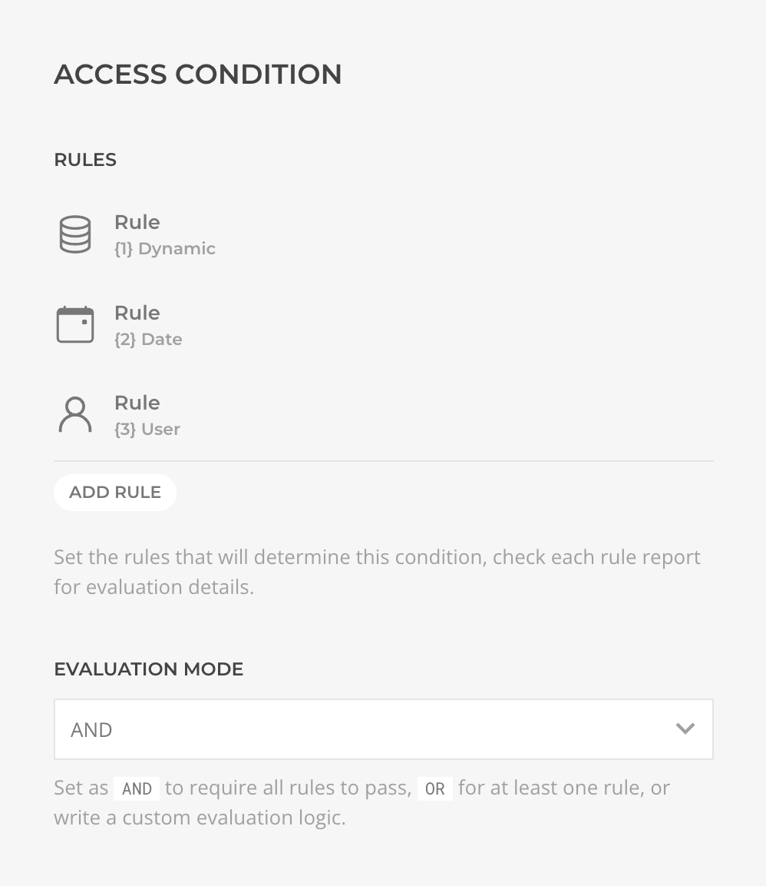

# Access Condition

An Access Condition is a set of rules with a predefined or custom evaluation logic that will decide whether or not the current element should be displayed. It also supports Dynamic Content and logs.

## Composable Rules

The Access Condition includes a variety of core rules, totaling over 16, which are organized into groups of Site, Device and DateTime. It is possible to include multiple types of the same rule within a single condition, with different configurations.

## Evaluation Mode

When an Access Condition is applied to an element, it will first evaluate each of the specified rules individually, then will apply an evaluation mode, `AND|OR|Custom`, to determine the final result. The `AND` mode requires all rules to pass, `OR` mode requires at least one, while `Custom` mode would apply a custom logic.

A custom logic is inputed with a query that references each rule using their order number within brackets, such as `{1}`, and use `AND|OR` operators, such as `{1} AND {2}`, or `{1} OR {2}`. Parentheses can also be used to alter the execution order, such as `({1} AND {2}) OR {3}`.

## Evaluation Logs

While in the customizer, the Access Condition will display evaluation logs for each rule as well the final result. These logs can be used to gain insights into the evaluation process and troubleshoot any issues with the logic.

