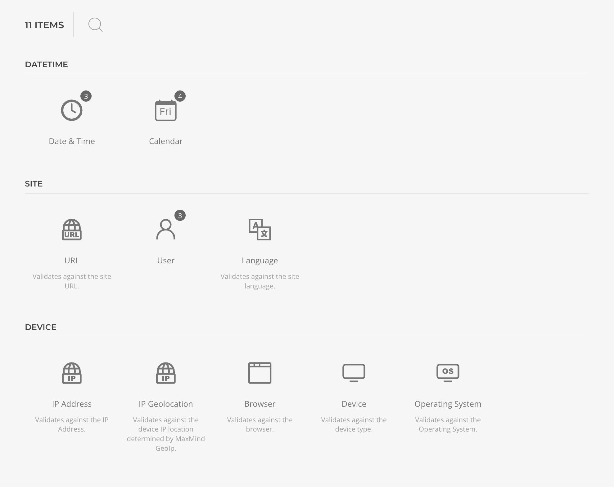
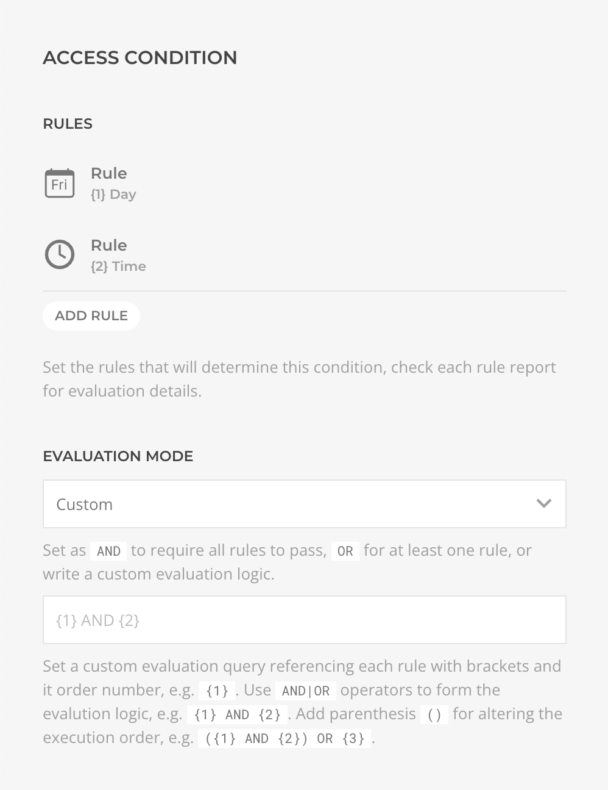
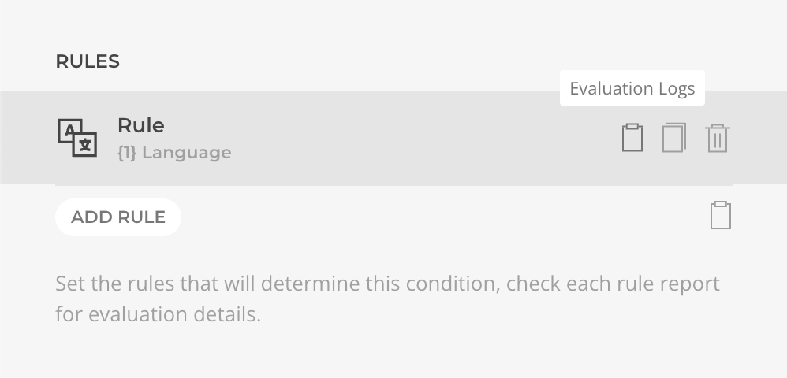
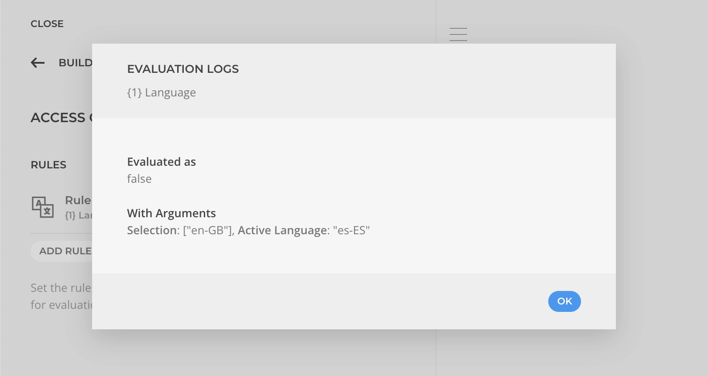

# Access Conditions Overview

Compose rules that will determine the evaluation criteria for rendering an element. With support for static and dynamic values, establish custom evaluation logic, and view logs directly in the builder to gain a better understanding of the evaluation results.

The rules are composed in the builder element _Advanced Tab_ settings. Go through the [Integration Guide](./integration) to learn more about how to set a condition.

## Composable Rules

Essentials provides a variety of core [rules](./rules), totaling over 16 organized into groups of _Site_, _Device_ and _DateTime_. It is possible to include multiple types of the same rule within a single condition, with different configurations.

## Evaluation Mode

When an Access Condition is applied to an element, it will first evaluate each of the specified rules individually, then will apply an evaluation mode, `AND|OR|Custom`, to determine the final result. The `AND` mode requires all rules to pass, `OR` mode requires at least one, while `Custom` mode would apply a custom logic.

A custom logic is inputed with a query that references each rule using their order number within brackets, such as `{1}`, and use `AND|OR` operators, such as `{1} AND {2}`, or `{1} OR {2}`. Parentheses can also be used to alter the execution order, such as `({1} AND {2}) OR {3}`.

## Evaluation Logs

While in the customizer, the Access Condition will display evaluation logs for each rule as well the final result. These logs can be used to gain insights into the evaluation process and troubleshoot any issues with the logic.

