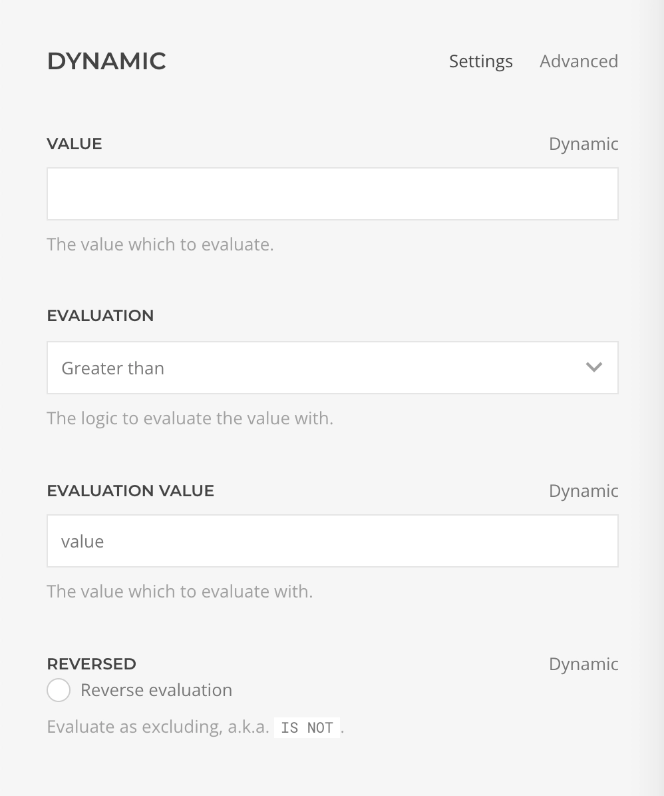

<!--@include: ./_partials/intro-->

The Dynamic Access Rule determines whether a given value satisfies a specific set of conditions. This rule is flexible and can be applied to [various scenarios](#use-cases) as both the value being evaluated and the condition value can be set either statically or dynamically.

## Settings

| Setting | Description | Required | Dynamic |
| ------- | ----------- | :------: | :-----: |
| **Value** | The value that must validate for the condition to be considered valid. | &#x2713; | &#x2713; |
| **Evaluation** | The logic that will be applied to the specified value, `Is empty`, `Includes`, `Equals to`, `Greater than`, `Starts with` or `Ends with`. | &#x2713; |
| **Evaluation Value** | The value that the main value will be evaluated with, if required by the evaluation logic. | &#x2713; | &#x2713; |
| **Reversed** | Whether the evaluation result should be returned reversed. Use it to set a condition as `IS NOT`. | | &#x2713; |

::: details Advanced Settings
<!--@include: ./_partials/advanced-settings-->
:::

## Use Cases

### Today Date Comparison

Evaluate if a specific date is **before than** or **after than** today.

1. Set the value as the date which should be compared with today, formated as `Y-m-d`.
1. Set the condition field as **Greater than** or **Less than**.
1. Set the condition value as dynamic mapped to a `Request Source -> Timestamp Field`, formated as `Y-m-d`.
