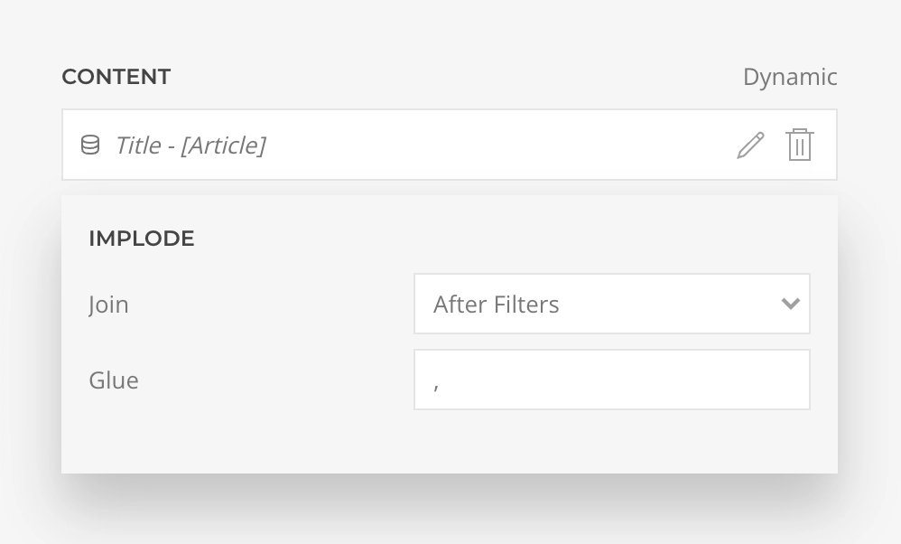
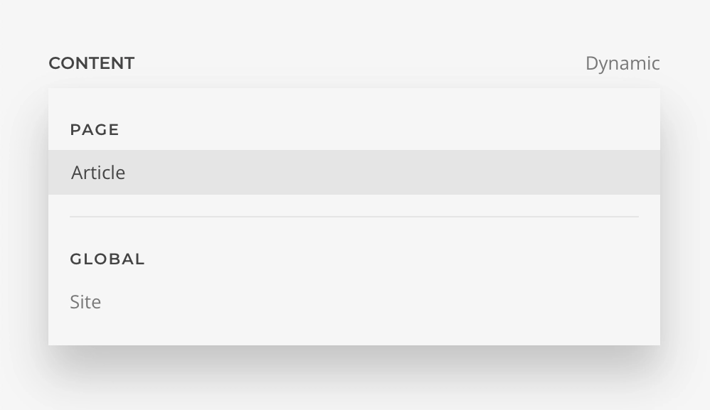
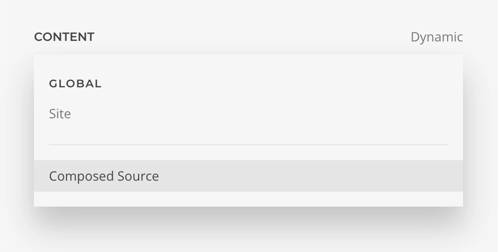
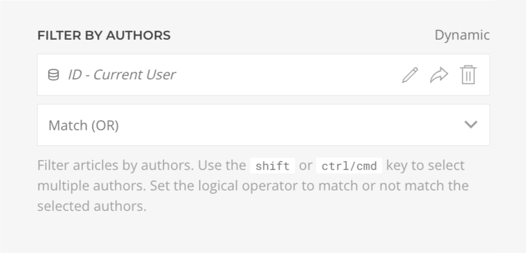

# Extended Workflow

YOOtheme Pro [Dynamic Content](https://yootheme.com/support/yootheme-pro/joomla/dynamic-content) has been extended with advanced features that integrates natively into the workflow. Don't worry much about those, simply set your layouts dynamic content as documented by YOOtheme and find next what are those advanced features all about.

## Field Sources

In YOOtheme Pro a dynamic content source is set on a node level, e.g. a Text element, in which case the elements fields will be enhanced with an option to map a dynamic content from the node source. Essentials expands on that notion adding the option to choose a source on an element field level regardless of the element source configuration.

With that in mind is expected that a Dynamic option will always be present above the element fields allowing to map to those any source directly.


If the mapped source content results in multiple values, those will be joined with a custom separator, or optionally left as is for the underlying element to deal with the content instead.



### Inherit Node

What if a source has already been set in the element! In such case, an _Inherit Node_ option will appear and you can opt to inherit the souce from the node for that field specifically.


### Inherit Parent

Similarly, if an upper level parent with a source is found, an _Inherit Parent_ will appear as a dynamic option.


### Page Sources

If there are source queries related to the current view, e.g. _Article_ or _Post_, those will be available as dynamic options under the _Page_ group.



### Global Sources

Global sources will always be available under the group _Global_, such is the _Site Source_, as well as the custom set [global queries](#global-queries).


### Custom Queries

If none of the dynamic options fit the use case, there is a _Custom Query_ option that allows fetching a source with a custom query.


::: warning
Custom queries might affect page loading performance as the query would be executed for each field instead of each node. When possible, set those on a node level instead.
:::

### Composed Sources

Finally, the _Composed Source_ option allows composing any dynamic options in a free-form text where sources are simple to set placeholders. As this is rather a feature reach option there is a [dedicated documentation](composed-sources) about it.



## Global Queries

A global query is a custom source query made available as a global dynamic source option. It can help speed up the creation of layouts that use complex queries over and over. Those can be managed within the [Global Queries Manager](/essentials-for-yootheme-pro/settings#global-queries).


## Query Arguments

YOOtheme Pro Dynamic source queries arguments are limited to static configuration. Essentials breakes through that limitation and allows setting dynamic arguments opening the door for even more advanced dynamic workflows.



::: warning Obvious Limitation
The arguments dynamic options are limited to _Page_, _Global_ and _Custom_ sources. That's expected as it would not be possible to inherit dynamic content from a node which source hasn't been set yet!
:::

If you want your custom sources to support this feature, add `'source' => 'true'` property to your source query aguments configuration.

```php
// query fields configuration
'fields' => [
    'events' => [
        'type' => [
            'listOf' => 'Event',
        ],
        'args' => [
            'timeMin' => [
                'type' => 'String',
            ]
        ],
        'metadata' => [
            'fields' => [
                'timeMin' => [
                    'label' => 'Time Min',
                    'source' => 'true',
                ],
            ],
        ],
    ],
]
```
