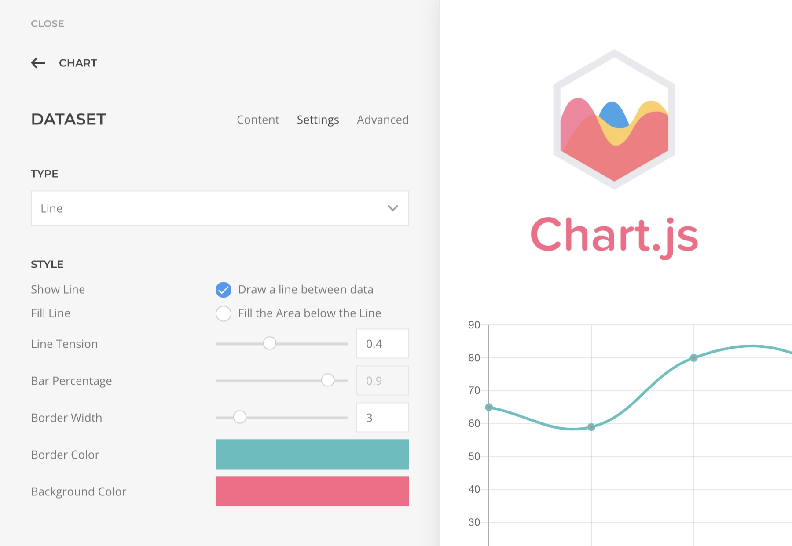

# Chart Element

A chart element based on Chart.js.

The Chart Element allows you to display static and dynamic data using visually appealing charts and graphs based on the popular JavaScript library [Chart.js v4.3.0](https://www.chartjs.org/docs/4.3.0/).

Variety of chart types are supported, including Line, Vertical Bar, Horizontal Bar, Radar, Pie, Doughnut, Polar Area, Bubble, and Scatter. You can also customize the appearance of your charts using a range of options and settings.

## Quick Start

Setting up a Dynamic Chart can be somewhat overwhelming, for an easier start you can download this combo of a _Section_ plus _CSV Data_ and then do this simple setup:

1. Download both files bellow.
1. Copy the CSV file to a folder of the site.
1. Create a new CSV Source based on that file.
1. Import the Section in the builder and open the Chart element configuration.
1. Open the _Dataset_, then again open its _Data Item_.
1. In the _Advanced Tab_ of the item choose the previously created CSV source as its Dynamic Content.

<!-- TODO -->
<!-- 
    
    
 -->

::: warning Sources Addon Required
Notice that this preset is dependent on the premium [Sources Addon](/essentials-for-yootheme-pro/addons/sources/) for the CSV data source creation.
:::
