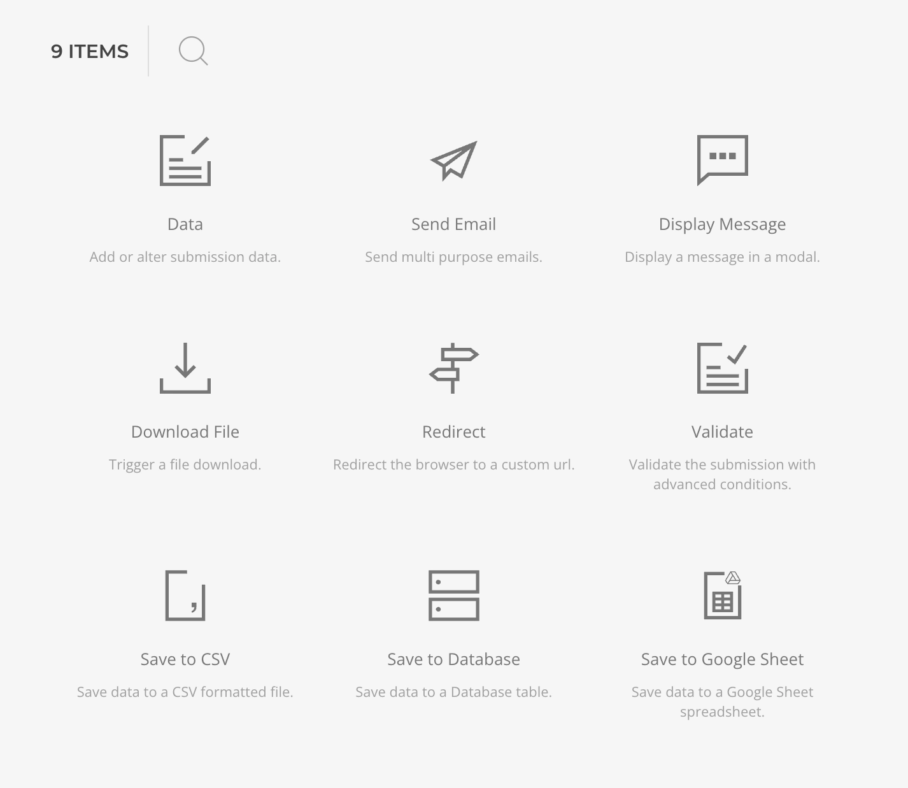

# After Submit Actions

After Submit Actions are [multi-instance](#multi-instance) functions that will run sequentially, after a form has been successfully submitted, as long as the chain is not disrupted by an error. These are crucial for the form workflow, as submission data is not processed or logged unless there is an action set for the task.

Actions are configured in the [Form Area Configuration](../form-area#configuration) and tipically involves sending an email or saving the submission data to the database. For a full overview of available actions and their capabilities, consult the [actions reference](../actions) section.

## Multi-Instance

In computing, "multi-instance" refers to the ability to have multiple identical instances running in parallel or in sequence to each other. In the context of actions, a multi-instance action setup means that it is possible to set up multiple actions of the same type, each with its own configuration and content.

## Conditional Execution

Actions can be manually disabled by setting their status to `disabled`, or dynamically by composing an Execution Condition in the Advanced Tab. The condition supports Dynamic Content, including [submission data](../dynamic#submission-data-source), which enables advanced workflows, e.g. subscribing to a newsletter only if it has been indicated in the form submission.

