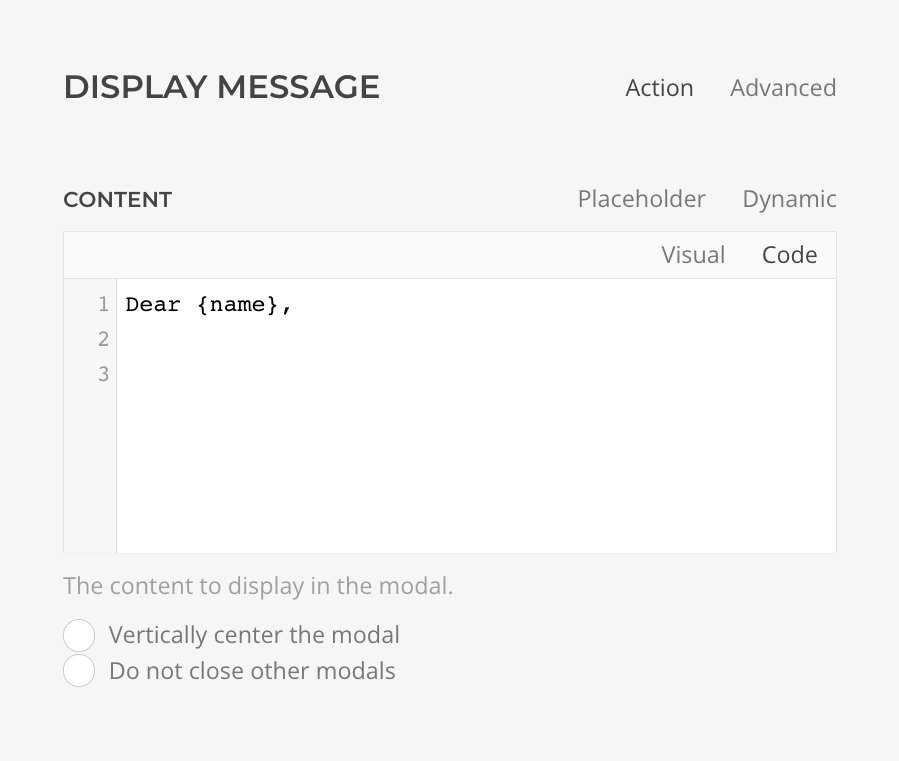

# Data Workflow

Forms are dynamic in nature as it is YOOtheme Pro builder with dynamic content. Essentials forms builds up on both to create a data workflow before and after a submission.

## Data Placeholders

Data placeholders are plain string references to the submitted data based on their control names. For instance, if there is an input field with the control name _email_, the placeholder reference would be `{email}`. These placeholders can be placed in action settings and will be replaced with the submitted data value during the action execution.

<small>
As a quick reference a list of available placeholders can be accessed by clicking the Placeholder Button.
</small>

## Form Area Source

For each Form Area, a dynamic content source is created as an alternative, and more convenient, way of accessing submitted data during actions configuration. As a dynamic source, it has all the advantages of [YOOtheme Pro Dynamic Content](https://yootheme.com/support/yootheme-pro/joomla/dynamic-content), like the ability to alter the submitted data with filters.

The mapping option for the form area source will be listed as part of each field _Dynamic_ options under the _Submission Group_.

## Page Sources

In certain form workflows, there may be a need for dynamic content from the current page, also known as page sources. This content is available during the form rendering, but is not during the form submission, which is why it's not listed as a mapping option. To work around this limitation page content can be mapped to a [hidden form field](./elements#hidden) and referenced in the actions using [data placeholders](#data-placeholders) or a [form area source](#form-area-source).

::: warning Hidden, But Still Exposed
It's important to note that although hidden field content is not visible on the page, it is still exposed in the source code of the page. If the data is sensitive, it's crucial to enable the encryption setting in the hidden field to ensure that it remains secure and protected from unauthorized access or disclosure.
:::

## Contextual Data

Contextual data such as the current date and time, page URL, and user IP are not included in the submission by default. However, since this information is available within dynamic sources, it can be easily mapped to the actions when necessary.

As a quick reference use these sources:

| Data | Source |
| --- | --- |
| Datetime | *Request -> Timestamp* |
| User IP | *Request -> IP* |
| Page URL | *Request -> Href* |

## Validation

For a form data to be submitted it must pass the fields validation as well as the CAPTCHA validation, if any present. The validation is first run in the browser, and once again via server-side ajax request.

Each field has its own validation rules which can be set independently under the element _Validation Tab_ settings. For more information and integration details, refer to [elements](./elements) documentation.

::: warning Custom Error Message
At the moment, it is only possible to customize the validation error messages for server-side validation, not for HTML5 validation. A workaround is to disable HTML5 validation in the Form Area configuration.
:::
