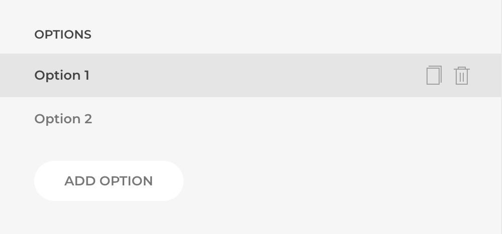

<!--@include: ./parts/intro.md-->

The **Checkbox Element** displays a group of [\<input type="checkbox"\>](https://developer.mozilla.org/en-US/docs/Web/HTML/Element/input/checkbox) HTML elements wrapped in a `<label>`, use it to allow users choosing, by toggling boxes, a single or multiple pre-established options.

## Settings

It inherits common settings with the following specifics:

| Setting | Description |
| ------- | ----------- |
| **Layout** | The layout that will be used to display the options, `Vertical` or `Horizontal`. |

::: details Common Settings
<!--@include: ./parts/common-settings.md-->
:::

## Options

Options are specified as child items that can be input manually as well as dynamically with the use of a Dynamic Content source. Each option has the following settings:

| Setting | Description |
| ------- | ----------- |
| **Value** | The option value, must be a unique among its siblings. | &#x2713; |
| **Text** | The option text, defaults to the value if omitted. HTML tags are supported. | &#x2713; |
| **State** | Defines if the option is `Disabled` or `Enabled`. Disabled options are unusable and unclickable. | &#x2713; |
| **Id** | The option ID attribute, overrides any ID set in the parent element. | &#x2713; |

## Validation

It inherits common validation with the following specifics:

| Validation | Description | Dynamic | Browser Side | Server Side |
| ---------- | ----------- | :-----: | :----------: | :---------: |
| **Min** | The minimum amount of options that must be chosen, `greater than` or `equal to`. | &#x2713; | | &#x2713; |
| **Max** | The maximum amount of options that can be chosen, `lower than` or `equal to`. | &#x2713; | | &#x2713; |

::: details Common Validation
<!--@include: ./parts/common-validation.md-->
:::

## Integration

1. Access a Builder layout and create a Form Area.
1. Add a Checkbox Element from the Form Essentials group.
1. Access the element settings and input a Control Name.
