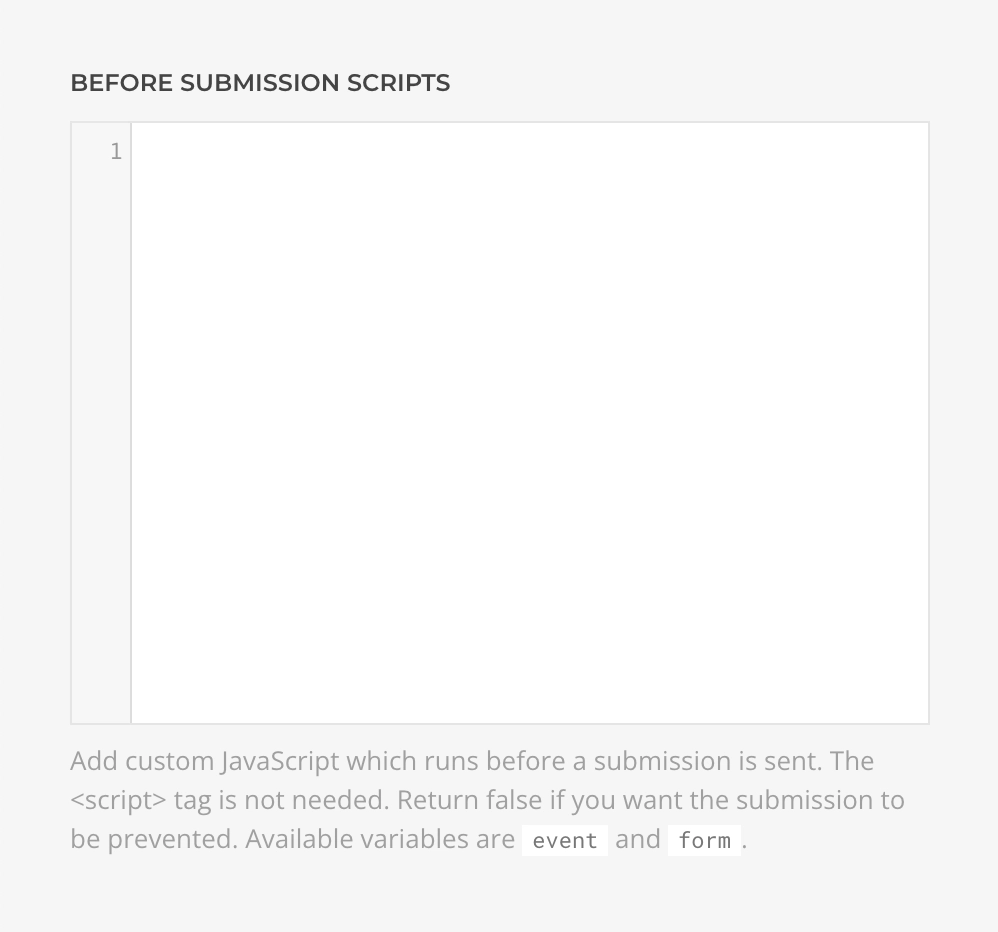

# Form Area

When a _section_, _column_ or _sublayout_ is defined as a form area, within the element _Advanced Tab_ panel, it is enclosed with a standard `<form\>` HTML element without losing builder capabilities. Forms are dynamic in nature as it is YOOtheme Pro builder with dynamic content. Essentials forms builds up on both to create a dynamic data workflow before and after a submission.

For every form area a `paper-plane`  icon will appear in the builder's main panel to both state that the element is a form area as well as to allow directly opening its configuration panel when clicked.

## Configuration

The form area configuration panel contains form specific settings, including [after submit actions](./after-submit-actions.md).

| Setting | Default | Description |
| --- | --- | --- |
| *After Submit Actions* | `[]` | List of actions to execute after a successful submission. At least one action is necessary. |
| *HTML 5 Validation* | `true` | Whether to execute front side HTML5 validation before submission. Server side validation is always executed. |
| *Reset After Submit* | `true` | Whether to reset the form to it initial state after a successfull submission. |

::: tip Note
For field specific validation refer to [elements field settings](./elements).
:::

| Setting | Default | Description |
| --- | --- | --- |
| *Display in Modal* | `false` | Wether to display server side errors in a Modal instead of the bottom block. |
| *Modal Content* | | The content to be displayed in the modal, use `{errors}` as placeholder for the list of errors. |
| *Center Modal* | `false` | Wether to vertically center the modal. |

| Setting | Default | Description |
| --- | --- | --- |
| *Name* |  | A custom name attribute for the form dom node. |
| *ID* |  | A custom ID attribute for the form dom node. |
| *Class* |  | Custom classes for the form dom node. |

| Setting | Description |
| --- | --- |
| *Action URL* | The URL where the form should submit the data to. |
| *Action Method* | The method that should user for submitting the data, `GET` or `POST`. |

::: warning Side Effects
Notice that when a custom action URL is set, server-side validation and after submit actions will not be executed.
:::

| Event | Scope Variables | Description |
| --- | --- | --- |
| *Before Submission* | `event`, `form` | Executes before the submission allowing to prevent it. |
| *After Submission* | `event`, `form`, `data`, `response` | Executes after successfull submission. |
| *After Submission Error* | `event`, `form`, `data`, `errors`, `validation` | Executes after server side submission error, including validation errors. |
| *After Validation Error* | `event`, `form`, `data` | Executes after front-end validation error. |

::: tip
For more advanced customizations consult [Extending Forms](./form-events) section.
:::

## Data Placeholders

Data placeholders are plain string references to the submitted data based on their control names. For instance, if there is an input field with the control name _email_, the placeholder reference would be `{email}`. These placeholders can be placed in action settings and will be replaced with the submitted data value during the action execution.

<small>
As a quick reference a list of available placeholders can be accessed by clicking the Placeholder Button.
</small>

::: tip
For a more advanced data workflow combine a [composed source](/essentials-for-yootheme-pro/addons/dynamic/composed-sources) with a [forma area dynamic source](./form-area#form-area-dynamic-source).
:::

## Validation

For a form data to be submitted it must pass the fields validation as well as the CAPTCHA validation, if any present. The validation is first run in the browser, and once again via server-side ajax request.

Each field has its own validation rules which can be set independently under the element _Validation Tab_ settings. For more information and integration details, refer to [elements](./elements) documentation.

::: warning Custom Error Message
At the moment, it is only possible to customize the validation error messages for server-side validation, not for HTML5 validation. A workaround is to disable HTML5 validation in the Form Area configuration.
:::
