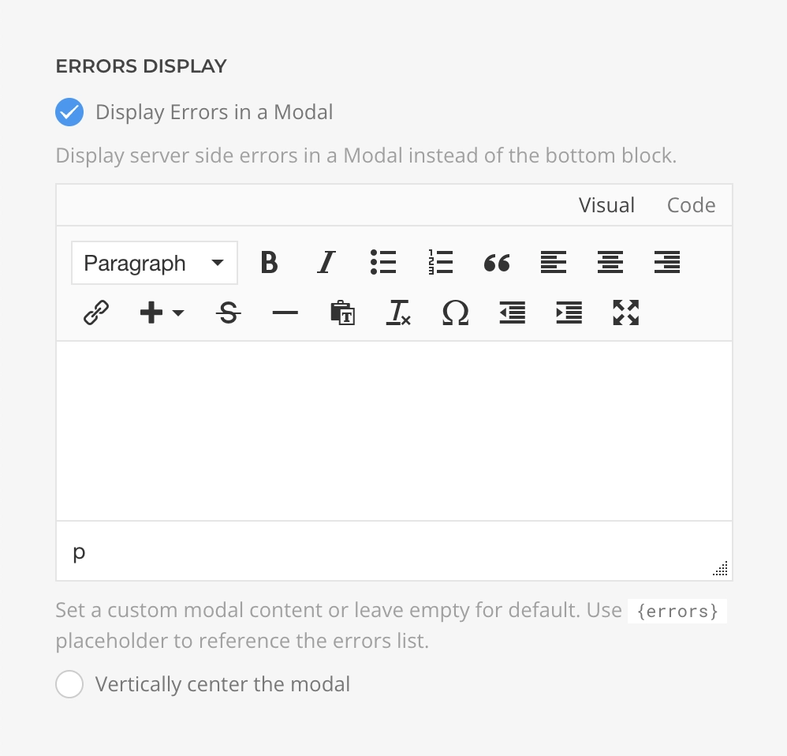

# Form Area

When a Section, Column or Sublayout is defined as a Form Area, it is enclosed with a standard `<form\>` HTML element without losing any builder capabilities. A Form Area limits the scope of the form configuration and fields structure, enabling the placement of multiple forms in the same page.

## Configuration

When a Form Area is established, a `paper-plane` icon will appear in the builder's main panel to both states that the specific node is a Form Area as well as to directly open its configuration panel.

The Form Area Configuration panel contains both general and advanced configuration [settings](#settings) for the form, as well as [After Submit Actions](./after-submit-actions), which are critical for the form workflow.

<small>Use the Form Area shortcut to access it configuration from the builder.</small>

## Settings

### Actions

At least one [After Submit Actions](./after-submit-actions) is required, consult individual [action reference](./actions/) for specifics.

### Validation

Global validation settings, for field specific validation refer to [field settings](./fields/).

| Setting | Default | Description |
| --- | --- | --- |
| *HTML 5 Validation* | `true` | Whether the front side HTML5 validation should be executed before submission. Server side validation is always executed. |

### Errors Display

Server and validation wise errors display options.

| Setting | Default | Description |
| --- | --- | --- |
| *Display in Modal* | `false` | Wether to display server side errors in a Modal instead of the bottom block. |
| *Modal Content* | | The content to be displayed in the modal, use `{errors}` as placeholder for the list of errors. |
| *Center Modal* | `false` | Wether to vertically center the modal. |

### Form Attributes

Form HTML node `id`, `name`, and `class` attributes, useful for customizations.

### Form Action Override

Custom **action** and **method** attributes allows for a 3rd party service integration or a custom submission workflow.

| Setting | Description |
| --- | --- |
| *Action URL* | The URL where the form should submit the data to. |
| *Action Method* | The method that should user for submitting the data, `GET` or `POST`. |

::: warning Side Effects
Notice that when a custom action URL is set, server-side validation and After Submit Actions will not be executed.
:::

### Custom Scripts

Custom scripts that will run on form events, for a more advance integration consult [Form Events](./form-events) section.

| Event | Scope Variables | Description |
| --- | --- | --- |
| *Before Submission* | `event`, `form` | Executes before the submission allowing to prevent it. |
| *After Submission* | `event`, `form`, `data`, `response` | Executes after successfull submission. |
| *After Submission Error* | `event`, `form`, `data`, `errors`, `validation` | Executes after server side submission error, including validation errors. |
| *After Validation Error* | `event`, `form`, `data` | Executes after front-end validation error. |
