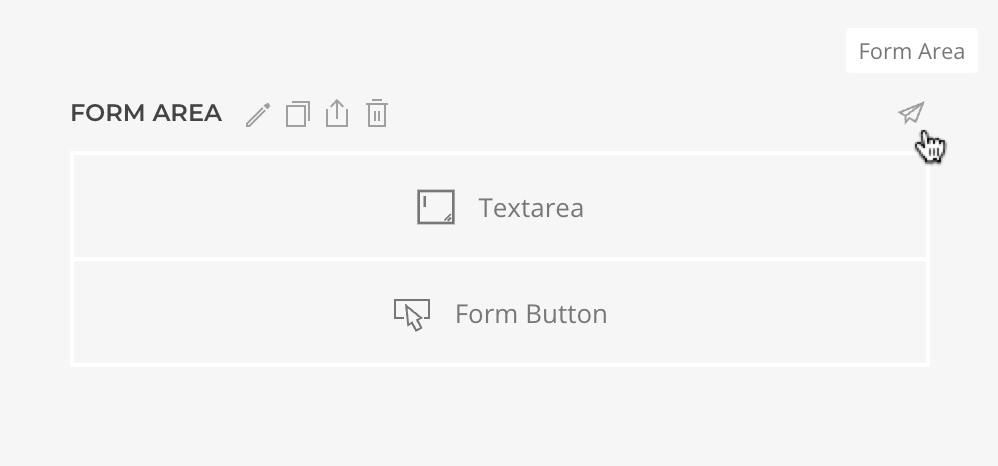
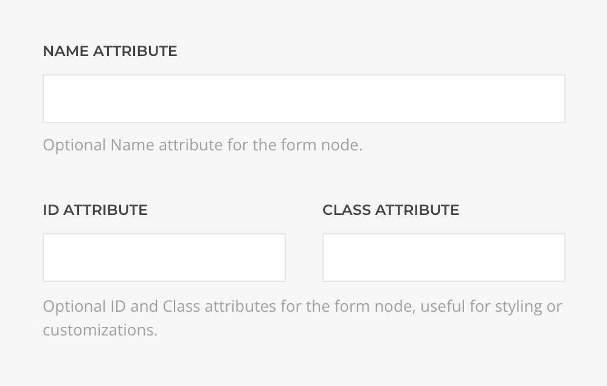
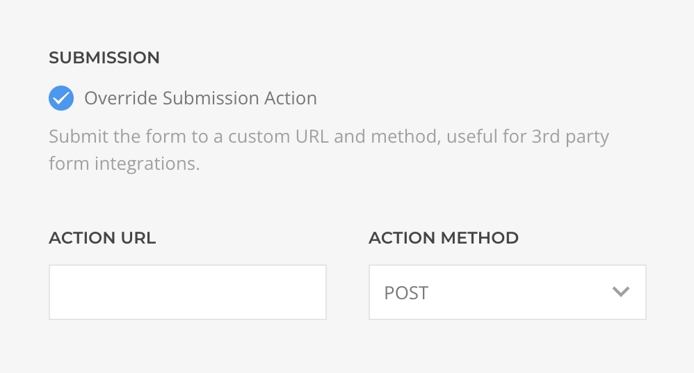

# Form Area

A form area is a layout _section_, _column_ or _sublayout_ defined as such in the _Advanced Tab_ settings. It configuration and fields structure is scoped, making possible the placement of multiple forms in the same layout.

For every form area a `paper-plane`  icon will appear in the builder's main panel to both state that the node is a form area as well as to allow directly opening its configuration panel when clicked.

## After Submit Actions

After Submit Actions, or simply actions, are multi-instance functions that will run sequentially, after a form has been successfully submitted, as long as the chain is not disrupted by an error. These are crucial for the form workflow, as submission data is not processed or logged unless there is an action set for the task.

Actions are set in the form area [configuration](#form-area-configuration) and tipically involves sending an email or saving the submission data to the database. For a full overview of available actions and their capabilities, consult the [actions](./actions) section.

Actions will by default be always executed unless their status has been manually set to `disabled`, or it execution condition dynamically been resolved to false. The execution condition supports Dynamic Content, including the form submitted data.

::: tip
Use execution conditions for advanced workflows, e.g. subscribing to a newsletter only if a specific checkbox has been checked on.
:::

## Form Area Configuration

The form area configuration panel contains form specific settings, including [after submit actions](#after-submit-actions).

| Setting | Default | Description |
| --- | --- | --- |
| *After Submit Actions* | `[]` | List of actions to execute after a successful submission. At least one action is necessary. |
| *HTML 5 Validation* | `true` | Whether the front side HTML5 validation should be executed before submission. Server side validation is always executed. |

::: tip Note
For field specific validation refer to [elements field settings](./elements).
:::

| Setting | Default | Description |
| --- | --- | --- |
| *Display in Modal* | `false` | Wether to display server side errors in a Modal instead of the bottom block. |
| *Modal Content* | | The content to be displayed in the modal, use `{errors}` as placeholder for the list of errors. |
| *Center Modal* | `false` | Wether to vertically center the modal. |

| Setting | Default | Description |
| --- | --- | --- |
| *Name* |  | A custom name attribute for the form dom node. |
| *ID* |  | A custom ID attribute for the form dom node. |
| *Class* |  | Custom classes for the form dom node. |

| Setting | Description |
| --- | --- |
| *Action URL* | The URL where the form should submit the data to. |
| *Action Method* | The method that should user for submitting the data, `GET` or `POST`. |

::: warning Side Effects
Notice that when a custom action URL is set, server-side validation and after submit actions will not be executed.
:::

| Event | Scope Variables | Description |
| --- | --- | --- |
| *Before Submission* | `event`, `form` | Executes before the submission allowing to prevent it. |
| *After Submission* | `event`, `form`, `data`, `response` | Executes after successfull submission. |
| *After Submission Error* | `event`, `form`, `data`, `errors`, `validation` | Executes after server side submission error, including validation errors. |
| *After Validation Error* | `event`, `form`, `data` | Executes after front-end validation error. |

::: tip
For more advanced customizations consult [Extending Forms](/essentials-for-yootheme-pro/developer/form-hooks) section.
:::

## Form Area Dynamic Source

For each form area, a dynamic content source is created as an alternative, and more convenient, way of accessing submitted data during actions configuration. As a dynamic source, it has all the advantages of [YOOtheme Pro Dynamic Content](https://yootheme.com/support/yootheme-pro/joomla/dynamic-content), like the ability to alter the submitted data with filters.

The mapping option for the form area source will be listed as part of each field _Dynamic_ options under the _Submission Group_.

## Form in a Modal

Out of the box, a form cannot be displayed in a Modal, but there are 3rd party solutions.

- [FS Teaser Card](https://flart.studio/yootheme-pro/teaser-card) by Flart Studio
- [DJ-Popup](https://dj-extensions.com/yootheme/dj-popup) by DJ Extensions
- [JP CE Modal Pro](https://extensions.joomlapro.com/product/ce-modal-pro) by JoomlaPro
