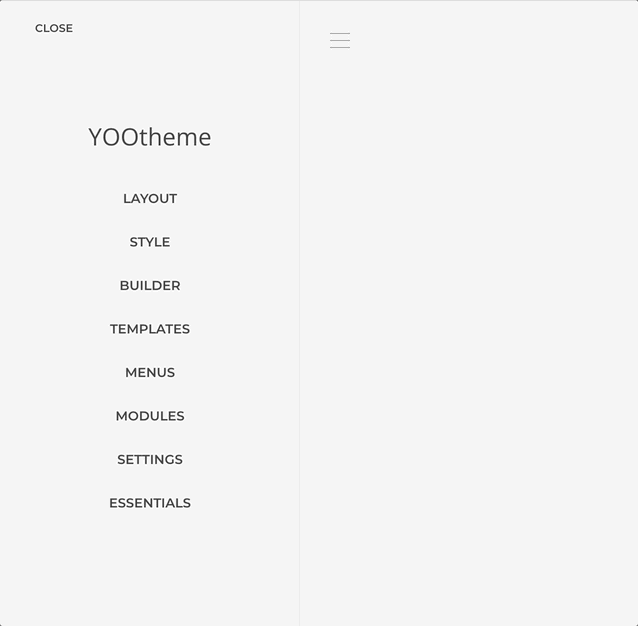

# Forms Addon

Empower a Section or Column as a Form Area with form builder and submission capabilities. Structure the area with fields and trigger actions after a successful submission.

## Integration

Follow through to learn how to create a Form Area. Even if you are already familiar with the concept you might learn something new.

<!--@include: ../_parts/enable-addon.md-->

### 1. Create a Form Area

A form must be structured inside of a Section or Column enabled as a [Form Area](../form-area), which can be done easily with just a few clicks.

1. Access the Customizer Builder area.
1. Locate a Section or Column which should be enabled as Form Area.
1. Open it `Advanced Settings` Tab and toggle the `Enable as Form Area` checkbox.

### 2. Add After Submit Actions

At least one [After Submit Action](../after-submit-actions) must be set for every form, otherwise, it will not trigger any action. In this case are going to greet the user adding a Message Action, but for more advanced scenarios, adding Email and SaveTo actions would be necessary to send an email and save the submitted data.

1. Open the Form Area configuration created in the previous step.
1. In the Actions tab add a new action of the type **Display Message**.
1. Input in the **Message** field a `Thank you for your submission, your comment was {comment}!`.

::: tip Notice the `{comment}` part
It's what we call [Data Placeholders](../dynamic#data-placeholders), and is one of the ways to set a dynamic workflow.
:::

### 3. Add Form Fields

Now we need to add fields to our form. Let's include a Comment field and a Submit button.

1. Go back to the builder main panel and add an element of a type Textarea from the `Form Essentials` group.
1. Open it configuration panel and input `comment` in the `Control Name` setting.
1. Add a Submission button by adding a Form Button element from the same group.

### 4. Test The Submission

Let's give it a try!

1. Locate the form in the Builder preview.
1. Input a message in the Textarea and Submit.

You should see a modal with the submitted message!
