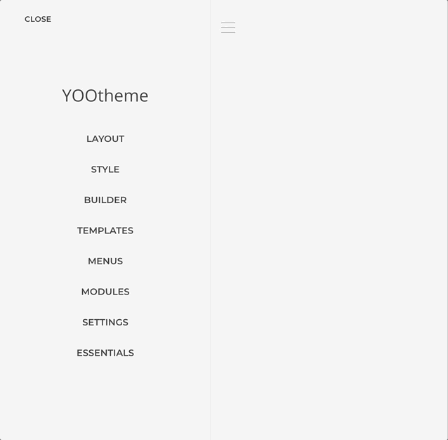
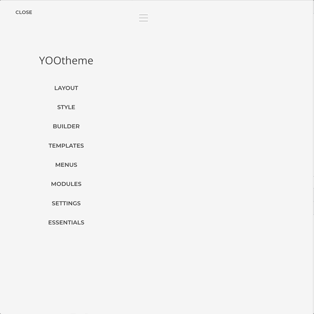

# Dynamic Sources

Generate content sources from configuration or service-dependent data, such as database tables, CSV files, Instagram media, Google Spreadsheets, and more.

---

<!--@include: ../_partials/enable-addon.md-->

## 1. Create a Source Instance

Essentials sources are not global, those do not pre-exist. Before being able to use an Essential source we must first create an instance of it.

1. Open the [Source Manager](#source-manager) and click on Add Source.
2. Choose the [source](./providers/) you want to make an instance from, e.g. [RSS](./providers#rss).
3. Set the source name and the configuration basics, e.g. _My Feed_ and `https://www.theverge.com/rss/reviews/index.xml`.
4. Leave the rest per default and save.

## 2. Map the Source Content

Once the source instance has been created it schema will be generated based on it configuration and it content made available for mapping as any other dynamic core source. And now we can map it content to our layout.

1. Open the builder layout where you want to map the source.
1. Add a new Text element to the layout and open the _Advanced Tab_.
1. Open the `Dynamic Content` select field and locate the _RSS_ group.
1. Choose _My Feed Entries_.
1. Open the element _Content Tab_ and map some data to the content field.

A list of the feed entries should render with the mapped data. For more insights about [YOOtheme Dynamic Content](https://yootheme.com/support/yootheme-pro/joomla/dynamic-content) workflow, consult the corresponding documentation.

## Source Manager

The Source Manager let us create as well as manage dynamic sources instances. It cab be accessed at `Customizer -> Essentials -> Sources` section.

