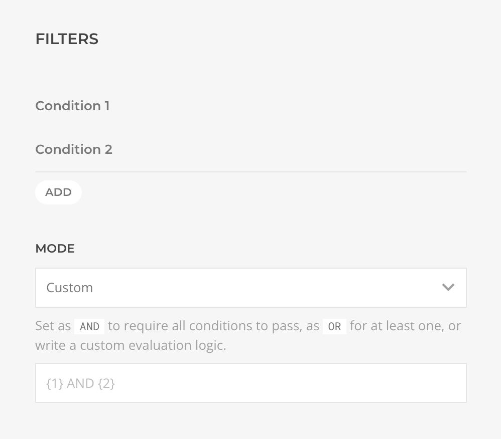
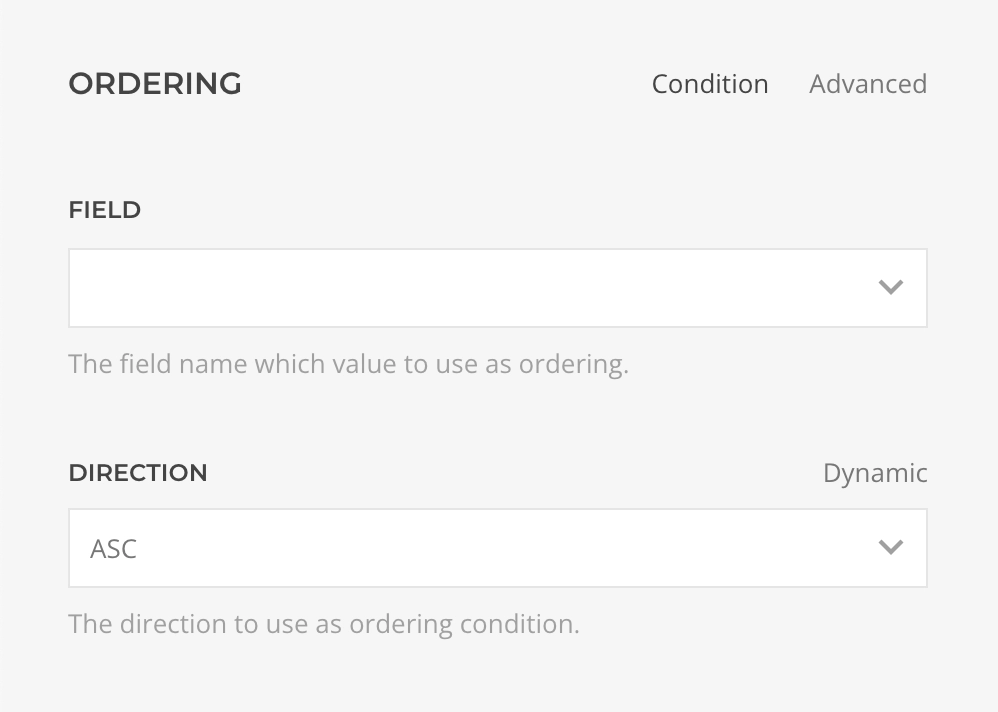
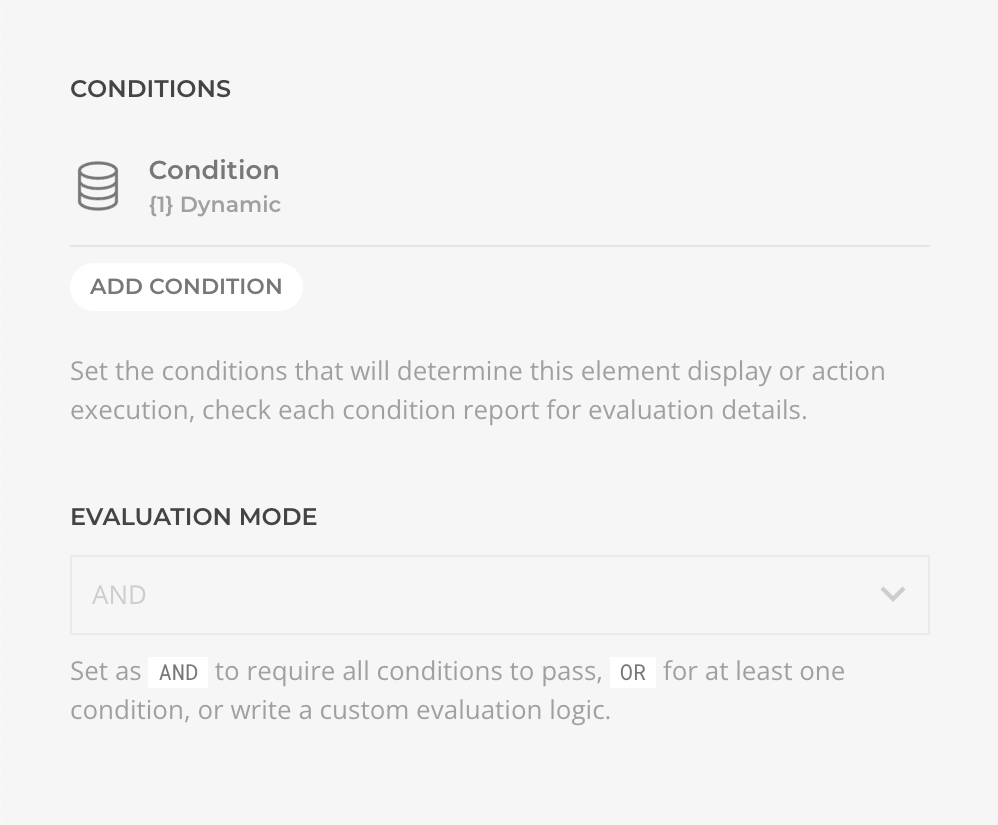

# Dynamic Sources Overview

Generate dynamic content sources from configuration or service-dependent data, such as database tables, CSV files, Instagram media, Google Spreadsheets, and more.

## Multi Instance

A multi-instance source is based on the same core principles introduced by [YOOtheme Pro Dynamic Content](https://yootheme.com/support/yootheme-pro/joomla/dynamic-content) sources, but allows running multiple identical instances in parallel. New instances schema is stored in the builder GraphQL Schema, being the final result and performance identical as of a standard source.

## Conditions and Filters

Apply conditions to the source content during fetching and/or rendering phase.

It's important to understand the different types of conditions in dynamic content, their differences in execution time or dynamic values support, and learn how to combine them effectively.

| Type | Description | Execution Time | Dynamic Support |
| --- | --- | --- | --- |
| [Query Conditions](#query-conditions) | Provided by each source individually. | Query | Partial |
| [Dynamic Condition](#dynamic-condition) | Provided globally as part of the Dynamic Content core workflow. | Render | None |
| [Access Condition](#access-condition) | Provided globally as part of the Essentials Access addon workflow. | Render | Full |

### Query Conditions

Filter and/or order query conditions are rules, applied during a query execution, that the content must evaluate to in order to be included in the fetched results. The conditions are provided and supported by every source individually.

::: details Filter Condition Details

#### Filter Condition

| Setting | Description | Dynamic | Required |
| --- | --- | :---: | :---: |
| *Name* | A name to better identify this condition. | &#x2713; |
| *Status* | Should this condition be evaluated. | &#x2713; |
| *Field* | The field of the currently evaluated record to use for the condition evaluation. | | &#x2713; |
| *Operator* | The operator for the evaluation, see full list bellow. | | &#x2713; |
| *-- Is Null* | The field must `be null`. |
| *-- Is not Null* | The field must `not be null`. |
| *-- Is empty* | The field must `be empty`. |
| *-- Is not empty* | The field must `not be empty`. |
| *-- Equal To* | The field must be `equal to` the specified value. |
| *-- Not Equal To* | The field must `not be equal to` the specified value. |
| *-- Less than* | The field must be `less than` the specified value. |
| *-- Greater than* | The field must be `greater than` the specified value. |
| *-- Less than or equal to* | The field must be `less than or equal to` the specified value. |
| *-- Greater than or equal to* | The field must be `greater than or equal to` the specified value. |
| *-- Starts with* | The field must `start with` the specified value. |
| *-- Ends with* | The field must `end with` the specified value. |
| *-- LIKE* | The field must `match a pattern` specified in value. |
| *-- LIKE %%* | The field must `match a pattern` specified in value which will be wrapped with `%` wildcard that represents `zero`, `one`, or `multiple` characters. |
| *Value* | The static or dynamic value that the field is being evaluated with. | &#x2713; | &#x2713; |

#### Filter Evaluation Logic

| Setting | Default | Description |
| --- | --- | --- |
| *Filters* | `[]` | The list of filter conditions applied during the query execution. |
| *Mode* | `AND` | The filter conditions evaluation logic, `AND`, `OR`, or `Custom`. |
| *-- AND* | | All conditions must evaluate as true. |
| *-- OR* | | At least one condition must evaluate as true. |
| *-- Custom* | | Reference a condition with brackets `{}` and it index number, e.g. `{1}`. Combine conditions with the logic operators `AND\|OR`, e.g. `{1} AND {2} OR {3}`. Alter the execution order with parenthesis `()`, e.g. `{1} AND ({2} OR {3})` where the conditions 2 and 3 will be evaluated first. |

:::

::: details Order Condition Details

#### Order Condition

| Setting | Description | Dynamic | Required |
| --- | --- | :---: | :---: |
| *Name* | A name to better identify this condition. | &#x2713; |
| *Status* | Should this condition be evaluated. | &#x2713; |
| *Field* | The field of the currently evaluated record to use for the condition evaluation. | | &#x2713; |
| *Direction* | The ordering direction, ascendent `ASC` or descendent `DESC`. | &#x2713; | &#x2713; |

:::

### Dynamic Condition

Part of the [Dynamic Content](https://yootheme.com/support/yootheme-pro/joomla/dynamic-content#dynamic-conditions) core workflow, Dynamic Condition is set during a source mapping to determine should the element be displayed. The amount of conditions is limited to one, and cannot use dynamic content for more advanced evaluation.

### Access Condition

Part of the [Access Addon](/essentials-for-yootheme-pro/addons/access/) workflow, Access Condition has the same functionality as the [Dynamic Condition](#dynamic-condition), but with support for dynamic content, multiple rules and custom evaluation logic. You can opt to use it instead as per higher possibilities.

### Execution Performance

With **Query Conditions**, the content is fetched pre-filtered and the load in memory minimum, e.g. from 500 items 20 would be loaded, then 20 elements rendered.

With **Dynamic or Access Condition**, all content is fetched into memory, then the elements are filtered during runtime, e.g. from 500 items 500 items would be loaded, then 500 elements conditioned during the pre-rendering phase, but only 20 rendered.

To optimize page loading speed and minimize the risk of memory errors, Query Conditions are the preferred method and should always be used if available. If not available, the next best approach is to combine different types of conditions. This is because the more data loaded into memory and processing required during runtime, the slower the page loads and the higher the risk of running into memory errors.

### Combined Conditions

Not all queries support conditions, and if do most likely do not support evaluating dynamic values. In such situations a good strategy is to combine **Query Conditions** with **Dynamic or Access Condition**. In practice that would mean load the minimum amount of content into memory, e.g. load items from a specific category, then further filter down those during the rendering.

::: warning Pagination Errors
Be aware of the pagination (offset and limit) while combining conditions as the results might not be what you expect. For example, you might set a limit condition of 20, but the final filtered result be 18.

As a rule of thumb, when an exact amount of items is required do not combine conditions.
:::
