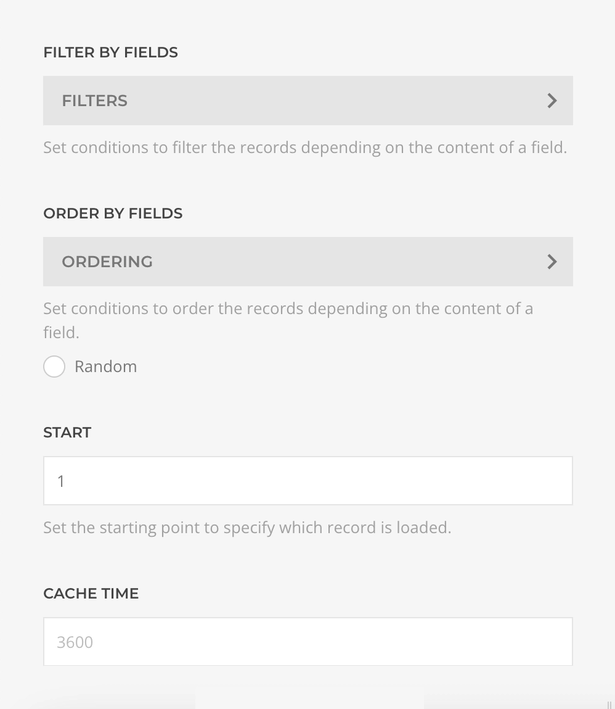

<!--@include: ../_partials/provider-intro-->

The Database Source feeds data from local or external MySQL Database Tables, supporting relations and dynamic filtering/ordering. Based on the [multi-instance](/essentials-for-yootheme-pro/addons/sources/multi-instance-sources) source workflow it allows connecting to multiple databases with different configurations.

## Settings

The source settings determines the content structure, every time the instance is saved the structure will be regenerated.

| Setting | Description | Required |
| ------- | ----------- | :------: |
| **Database** | The name of the database to which to connect to. Defaults to the site database. |
| **Table** | The table from which to create the source. | &#x2713; |
| **Primary Key** | The primary key of the selected table, this is specially important when using relations. | &#x2713; |
| **Custom Connection** | Should the connection to the database use [custom connection](#custom-connection) instead of the site one. |
| **Relations** | The list of [relations](#table-relations) and their configuration. |

::: details Common Settings
<!--@include: ../_partials/provider-common-settings-->
:::

### Custom Connection

The connection to the database will use the site configuration, but if `Custom Connection` is enabled the settings inputs will be used instead with support for local as remote servers.

| Setting | Description | Required |
| ------- | ----------- | :------: |
| **Host** | The IP or domain of the database server. | &#x2713; |
| **Port** | The port which to use to connect to the server. | &#x2713; |
| **Username / Password** | The credentials which to use to connect to the server. | &#x2713; |

### Table Relations

Complex data structures typically involve several tables related between them, if that's the case you can set as many relations as needed of the type:

- **One to One**, also known as **BelongsTo**, where a single entry relates with another single entry, e.g. Article belongs to an Author.
- **One to Many**, also known as **HasMany**, where a single entry relates with multiple entries, e.g. Article is assigned to many Categories.

| Setting | Description | Required |
| ------- | ----------- | :------: |
| **Name** | The name to associate the relation with. Should be meaningfull, e.g. `Author`. | &#x2713; |
| **Relation Type** | The relation type, `One to One` or `One to Many`. | &#x2713; |
| **Related Table** | The table that is being related with the main table. | &#x2713; |
| **Main Table Key** | The column key from the main table to use for the relation. | &#x2713; |
| **Related Table Key** | The column key from the related table to use for the relation. | &#x2713; |

::: tip MySQL Views
Relations can get complex and difficult to debug, an alternative simpler approach is to create a [MySQL View](https://dev.mysql.com/doc/refman/8.0/en/view-syntax.html) with the relations solved and use that view as the main table.
:::

## Content Queries

For every source instance the following content queries will be made available as Dynamic Content option.

### Record Query

Fetches a single record from the table and resolves to a dynamically generated record type based on the table schema.

| Setting | Default | Description |
| ------- | ------- | ----------- |
| **Filters** | `[]` | The list of filter conditions applied to the query. |
| **Ordering** | `[]` | The list of ordering conditions applied to the query. |
| **Random** | `false` | Should the ordering be randomized ignoring any ordering condition. |
| **Start** | `1` | The offset applied to the query. |
| **Cache** | `3600` | The duration in seconds before the cache is invalidated and the query re-executed. |

### Records Query

Fetches records from the table and resolves to a dynamically generated list of record type based on the table schema.

| Setting | Default | Description |
| ------- | ------- | ----------- |
| **Filters** | `[]` | The list of filter conditions applied to the query. |
| **Ordering** | `[]` | The list of ordering conditions applied to the query. |
| **Random** | `false` | Should the ordering be randomized ignoring any ordering condition. |
| **Start** | `1` | The offset applied to the query. |
| **Quantity** | `20` | The limit applied to the query. |
| **Cache** | `3600` | The duration in seconds before the cache is invalidated and the query re-executed. |
