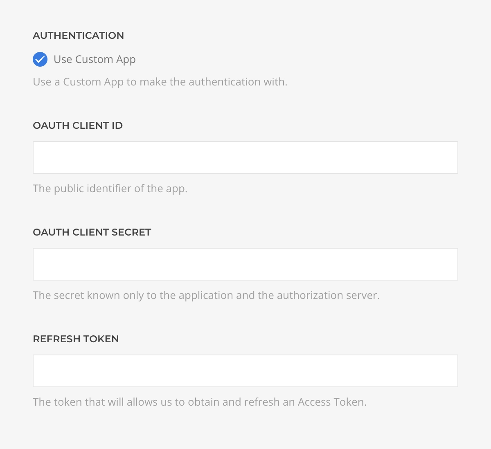
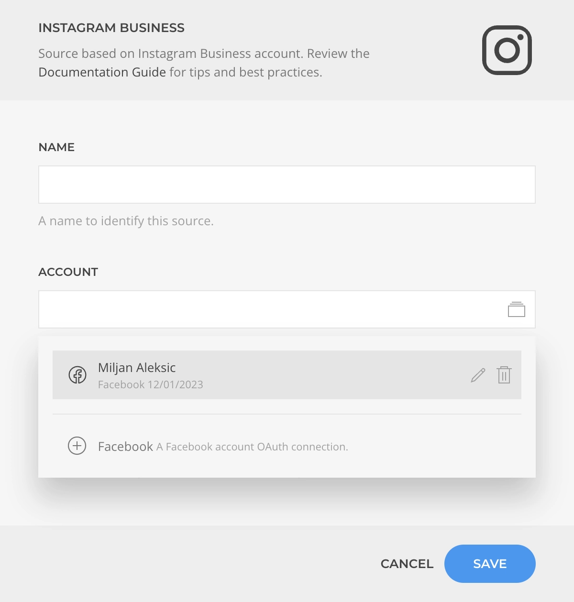

# Auths, Keys & Secrets

OAuths, Keys & Secrets is sensitive authentication data that we simply call, auths.

Essentials builds on top of YOOtheme Pro a workflow to authenticate to third-party services with the [OAuth](#oauth) protocol as well as to store [Keys and Secrets](#keys-and-secrets). The auth workflow has been built with [security](#security) in mind, as well as convenience through the [Auths Manager](#auth-manager).

## OAuth

This is the process where you authenticate to third-party services using the OAuth protocol and grant [Essentials OAuth App](#essentials-oauth-app), or your [Custom OAuth App](#custom-oauth-app), permissions to access content or act on your behalf.

## Essentials OAuth App

To use the OAuth protocol with a service, it is necessary to create an OAuth App within that service and go through its approval process. While creating an OAuth App is a recommended security measure, the process can be time-consuming and challenging.

To address these challenges, we have developed a web app that acts as an intermediary for all service-specific apps that have already been created and approved. This approach provides a simple and straightforward way for you to authenticate and grant permissions without having to go through the process yourself.

::: warning Quota Limitations
It is important to keep in mind that when using our OAuth App, the API quota is shared among other users. Although we keep our requests optimized and have not yet reached any limits, it is still necessary to consider the possibility it might happen.
:::

## Custom OAuth App

We strongly recommend that high traffic sites, or anyone with the necessary skills, create their own OAuth App and use its client ID and secret for authentication. This approach helps to avoid any potential quota limitations and provides additional security measures. By creating your own OAuth App, you can have more control over the authentication process and tailor it to your specific needs.

**See also**:

- [Create a Custom Twitter Dev App](./custom-twitter-dev-app)
- [Create a Custom Facebook Dev App](./custom-facebook-dev-app)

## Keys and Secrets

The auth workflow is a convenient way to securely manage keys and secrets that are required for certain features and services. By centralizing these keys and secrets you can ensure that they are stored securely and are easily accessible when needed. This helps simplify the management of these credentials and provide an additional layer of security.

## Security

The auth workflow has been built with security in mind but is important to understand the concepts behind it. By having a solid understanding of these concepts, you can ensure that your applications and services are properly secured and protected against unauthorized access or data breaches.

### Encryption

All auth tokens, keys and secrets are securely **encrypted** and stored within the [Essentials Settings](/essentials-for-yootheme-pro/settings), which is essentially a database table. This is a critical security measure as it ensures that these sensitive credentials are not exposed. Even if they were somehow accessed, the encryption would render them useless to any unauthorized party.

### OAuth Principles

We strictly follow the OAuth security principles and ensure that permissions are requested with the lowest possible scope required. In practical terms, this means that when accessing a resource, we request a read-only scope. Only when a resource is expected to be updated, do we request a read and write scope instead. By following these principles, we can minimize the amount of access granted, reducing the risk of unauthorized changes or data breaches.

It's important to note that any granted permissions can be revoked at any time by the service provider as well as by your request. This would immediately render all stored tokens useless, without the possibility of reactivation. This allows to quickly revoke access in the event of a security breach or any other unauthorized access.

### OAuth App

Using the ZOOlanders OAuth App is a convenient and secure, we do not store any login or token information. Instead, we pass this information directly to your site. However, for most services, we recommend creating a custom OAuth App and using it instead. This provides an additional layer of security and can help bypass any potential quota limitations.

## Auth Manager

The Auth Manager can be accessed at [Essentials Advanced](/essentials-for-yootheme-pro/settings#auths) section. You can manage OAuths, Keys & Secrets, but you cannot create new ones as an auth is tied to specific scopes, and/or purpose only, known while building the layouts.

It is also possible, and somewhat more convenient, to manage the auths while creating the resources that requires them.

